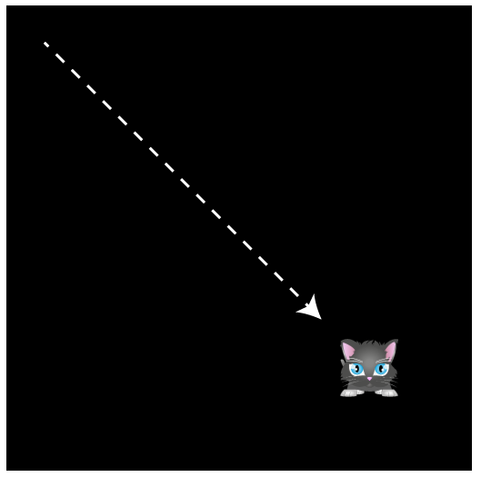

Smoothie
========

Smoothie is a super-fast and lightweight library that gives you ultra-smooth
sprite animation for the [Pixi renderer](https://github.com/pixijs/pixi.js) using true delta-time
interpolation. It also lets you specify the fps (frames-per-second) at
which your game or application runs, and completely separates your
sprite rendering loop from your application logic loop.
Why is this cool? Because it means you can run your application logic
at a crazy-low fps,
like 30 or 12, but your game sprites will still animate at the highest
rate at which your system is capable of. That gives you a huge boost
in processing overhead without sacrificing smooth animation. And, Smoothie will seamlessly
smoothe out all the frames in-between by interpolating sprite
positions.

Setting up
----------

Link the `smoothie.js` file in your HTML document with a `<script>`
tag.
```js
<script src="smoothie.js"><script>
```
But make sure you've also loaded Pixi. (If you don't know how to install
and use Pixi [you can find out
here](https://github.com/kittykatattack/learningPixi).

In your JavaScript file, first create a Pixi `renderer` and `stage`, like
this:
```js
var renderer = PIXI.autoDetectRenderer(512, 512);
document.body.appendChild(renderer.view);
var stage = new PIXI.Container();
```
Next, create a new instance of Smoothie. Initialize it with an
`options` object, which supplies Smoothie with the basic information
it needs to run. Here's how to initialize it with the minimum number
of options.
```js
var smoothie = new Smoothie({
  renderingEngine: PIXI, 
  renderer: renderer,
  rootContainer: stage,
  fps: 30,
  updateFunction: update.bind(this)
});

```
You can see that the first three options are the `PIXI` global object,
and the `renderer` and `stage` that you created in the first steps.

The fourth option, `fps` defines the frames-per-second at which your
game or application will run. If you leave this option out, Smoothie
will default to 60 fps. If you set it to `undefined` Smoothie will
remove the fps ceiling completely and run everything at the maximum
frame rate your system is capable of (usually 60, but some device
screens
refresh at 120.) You will loose the advantage of smooth sprite
animation with interpolation if you do this, but it's important to keep
this feature in mind just in case you need it.

The last option, `updateFunction` is extremely important! It's the name of the function that will
contain all of your game or application logic. It will run in a loop, at whatever
frame rate you've specified. Make sure to add `bind(this)` to the
function name to ensure that it runs in the correct scope. In this example, the name of the function is
called `update`. Here's a really simple example of the most basic
`update` function you could write.
```js
function update() {
  console.log("It loops!");  
}
```
(You can name this function anything you like, of course, it doesn't
have to be called `update`.)
Finally, the last thing you need to do is call Smoothie's `start` method to get
it running.
```js
smoothie.start();
```
Now you would see "It loops" displayed in the browser's console at 30
frames per second.

This is the minimum setup that you need, but let's look at a more
typical example that animates a sprite.

Animation
---------

In this repository's `examples` folder you'll find a `helloWorld.js`
file that contains all the working code for this next example. It very
simply animates a cat sprite from the top left corner of the screen to
the bottom right.



The JavaScript file first creates the Pixi renderer and stage, and
uses them to initialize Smoothie.
```js
//First, Create a Pixi renderer and stage
var renderer = PIXI.autoDetectRenderer(512, 512);
document.body.appendChild(renderer.view);
var stage = new PIXI.Container();

//Next, create a new instance of Smoothie
var smoothie = new Smoothie({
  renderingEngine: PIXI, 
  renderer: renderer,
  rootContainer: stage,
  updateFunction: update.bind(this),
  fps: 30
});
```
Pixi's loader is then used to load an image of the cat from the
`images` folder.
```js
PIXI.loader
  .add("images/cat.png")
  .load(setup);
```
As soon as the image is loaded, the loader calls the `setup` function.
The `setup` function creates the `cat` sprite, and, very importantly,
starts Smoothie.
```js
var cat;

//This code will run when the loader has finished loading the image
function setup() {

  cat = new PIXI.Sprite(PIXI.loader.resources["images/cat.png"].texture);
  stage.addChild(cat);

  //After everything is set up, 
  //start Smoothie by calling its `start` method
  smoothie.start();
}
```
We assigned the `update` function to Smoothie's `updateFunction`
property, so we need to include it in our program. Our `update` function
will contain all the code needed to animate the sprite, and will run at
the same fps that we assigned to Smoothie.
```js
function update() {

  //Use any physics or game logic code here
  cat.x += 1;
  cat.y += 1;
}
```
What's so cool about Smoothie is that even though your game logic might be
running at a very low frame rate, like 12 fps, your animations will
render at the highest frame rate that your system is capable of. That
gives you a vast amount of extra processing power to play with - just
what you need for math or physics-heavy games. And,
Smoothie smoothes out any rendering variations between frames caused by
hiccups in the browser, like garbage collection spikes. That
means you get ultra-smooth animation at any frame rate. And, your
render loop is completely separated from your game logic loop.

You can add any game logic, animation or physics code to your `update`
function, or use it as the basis for creating a game state manager,
[as described here](https://github.com/kittykatattack/learningPixi#gamestates). Smoothie does all the hard work for you -
you'll never have to worry about rendering again.

More about Smoothie's options
-----------------------------

In addition to the 5 options you can supply to Smoothie's constructor
when you initialize it,
there are few more you can - optionally - supply.

Smoothie interpolates each sprite's position (its `x` and `y` values)
and `rotation` by default. However, you can interpolate more properties if
you need to: size (`width` and `height`), scale (`scale.x` and
`scale.y`) and `alpha`. You can switch on interpolation for all these
properties by adding the `propertiesToInterpolate` option in
Smoothie's constructor. Supply it with an array of strings that define
the sprite properties you want to interpolate. Here's how to switch
all of them on:
```js
propertiesToInterpolate: [
  "position", "rotation", "alpha", "scale", "size"
]
```
Selectively add whichever properties you want. 

You can also add a Boolean `interpolate` property that defines whether
Smoothie should use interpolation (`true`) or not (`false`). 
```js
interpolate: true
```
If you set it to `false`, Smoothie will render the sprites and the `update`
function logic at the same frame rate. That means jittery animation at
low frame rates - if that's what you want, you've got it!

Just for your reference, here's an example of how you might initialize
Smoothie with all of its possible options.
```js
var smoothie = new Smoothie({
  renderingEngine: PIXI, 
  renderer: renderer,
  rootContainer: stage,
  updateFunction: update.bind(this),
  fps: 30,
  propertiesToInterpolate: ["position", "rotation", "alpha", "scale", "size"],
  interpolate: true
});

```
And don't forget to call Smoothie's `start` method when you're ready
to start animating!

Smoothie's properties
----------------------

Smoothie has a few properties that you can change at run-time.

- `fps`: Smoothie's frame rate. If you set `fps` to `undefined`,
  Smoothie removes the fps ceiling. It then runs the user-defined update
  function at the maximum frame rate your system is capable of. 
- `interpolate`: A Boolean (`true` or `false`) value to switch sprite
  interpolation on or off.
- `pause()`: A method to pause Smoothie. It stops the game loop from
  running.
- `resume()`: Resume Smoothie if you've paused it.

And now you know how to use Smoothie!

Advanced features
-----------------

Smoothie has a few extra features that you'll probably never need to
use. But, just in case, here they are.

###Set a rendering frame rate clamp

To help you fine tune your render loop, Smoothie give you a
`renderFps` property that lets you set the maximum frame
rate at which sprites should render. You
can set it either in the options or, like this:
```js
smoothie.renderFps = 40;
```
This will clamp the upper-limit rendering fps to 40.

Should you do this? Probably not! That's because browsers optimize
rendering in all kinds of complex and inscrutable ways so it's safer
just to trust that they're doing the best job they can. By setting a
rendering frame rate clamp, you're swimming against the current, and
that could cause more jankiness than you think it might solve. Still,
if you ever need to do this, you now know how!

###Find the Delta Time

The amount of difference between the Smoothie's frame rate and the
rate at which the browser is rendering sprites is accessible in a
read-only property called `dt` (for "delta time"). You can access it
like this:
```js
smoothie.dt
```
###Prevent texture bleed

If you ever notice any texture bleed in your sprites, set the sprite's
texture scale mode to `NEAREST`. Here's how:
```js
anySprite.texture.baseTexture.scaleMode = PIXI.SCALE_MODES.NEAREST;
```
This forces Pixi to display sprite images using integer (whole number)
pixel values, not floating point (decmial numbers) which is does by
default.
However, it will also make slow animations appear jankier because
sprite positions will appear change in minimum units of 1 pixel. A
better solution is to use a tool like (Texture Packer)[https://www.codeandweb.com/texturepacker] that
packages sprites with 2 pixels of padding around them to prevent
texture bleed.


